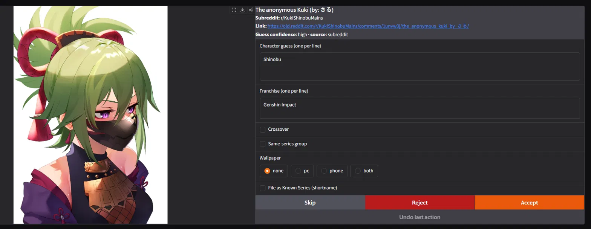
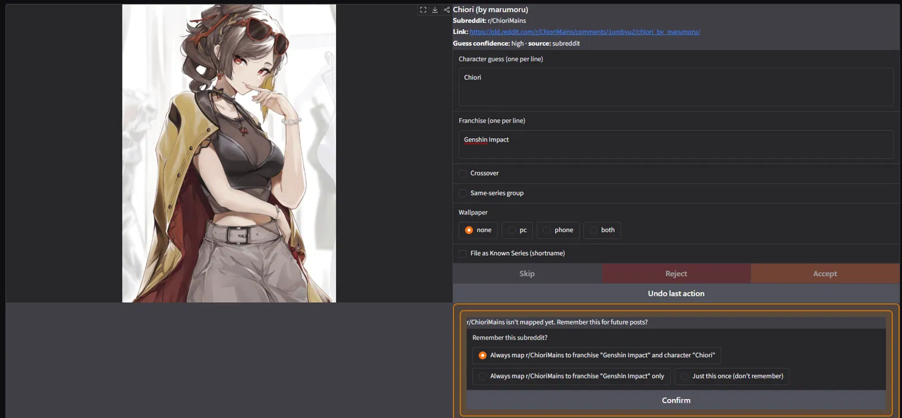
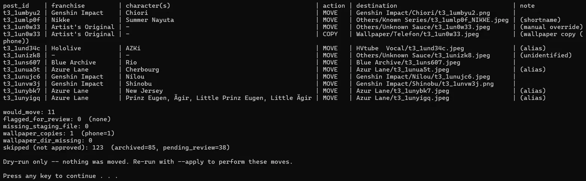
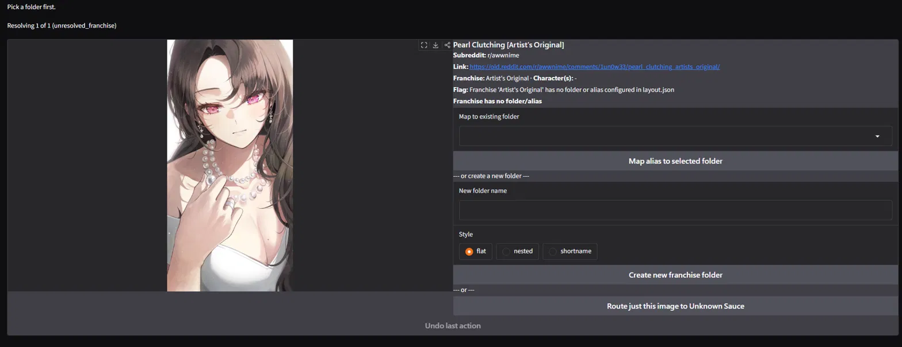

# Oshiire

A local, single-user pipeline that archives saved anime-style artwork from a
Reddit account. It reads a private Reddit "saved" RSS feed, downloads the
images, guesses the character(s) via post metadata and a local AI tagger as a
fallback, and presents each image in a small web UI for human approve/edit/
reject before filing it into a sorted personal archive.

Everything runs locally. No image, title, or metadata is ever sent to a third
party — the only outbound network calls are to Reddit itself (to read the
feed and download images).

**Setup & usage:** see [docs/SETUP.md](docs/SETUP.md).
**Reaching saves the RSS feed can't see:** see [docs/BACKFILL.md](docs/BACKFILL.md).

## How it works

```
ingest ─┬─ auto-tag (metadata) → AI fallback → human review → resolve (flags) → archive
        │                                           ↑
backfill ┘ (full history, via CSV export + perceptual-hash dedup)
```

Two ingesters feed one pipeline. `ingest.py` reads the recent RSS feed;
`backfill.py` sweeps the complete saved history from Reddit's data export,
using a perceptual-hash index of the archive to tell what you already own from
what is genuinely new. Everything after that point is shared.

The backfill subsystem is five modules:

- **`hash_index.py`** — builds a read-only 64-bit pHash index of `ARCHIVE_DIR`
  in local SQLite. This is what lets any stage ask "do I already have this
  picture?" without relying on post ids, which most hand-filed art never had.
- **`calibrate.py`** — measures the pHash distance distribution for *your*
  archive, so the owned/uncertain/new thresholds are your numbers rather than
  someone else's. Strictly a measurement tool; writes nothing but its report.
- **`backfill.py`** — the resumable, batched sweep itself. Three-way routing,
  rate-limit backoff, gallery expansion, and a cursor that survives a crash.
- **`tombstones.py`** — catches image hosts that serve a "this image was
  removed" placeholder card with HTTP 200, which a naive fetch happily files as
  art.
- **`export_unsave_list.py`** + **`oshiire_unsave.user.js`** — build a whitelist
  of provably-captured posts, and bulk-unsave only those from your own browser,
  to free headroom in Reddit's capped saved listing. Dry-run by default.

Two more support the daily loop: **`imagemeta.py`** (perceptual-hash cache and
the duplicate lookup the review UI shows) and **`history.py`** (a read-only
browser of already-processed entries).

A few design decisions matter more than the individual scripts:

- **`manifest.json` is the single source of truth.** Every stage reads and
  writes it; no stage calls another directly. All writes are atomic
  (write to a temp file, then `os.replace()`) so a crash mid-write can't
  corrupt it.
- **Ingestion is the only Reddit-specific part.** Everything downstream —
  tagging, review, archiving — works off the manifest schema, not off Reddit's
  data shape. Swapping in a different source only means writing a new ingester,
  which is exactly what `backfill.py` turned out to be: a second front end onto
  the same manifest, sharing every stage after it.
- **The AI tagger sits behind one seam.** A single function,
  `guess_character(image_path, post_metadata) -> Guess`, is the only thing
  downstream code depends on. Until the AI step runs it returns
  `Guess("Unknown", 0.0, "stub")`; the WD14 model lives entirely behind that
  seam, so nothing else needs to import `onnxruntime`/`imgutils`.
- **The AI is a fallback, never a replacement for review.** Guess precedence
  is manual edit > metadata match > AI guess > `Unknown`. Nothing reaches the
  final archive without a human clicking Accept.
- **Filing is conservative by default.** A new archive folder is only ever
  created by an explicit click in the review UI — the router never
  auto-creates one from a guess, and never overwrites an existing file.
  `archive.py` is dry-run by default; you have to pass `--apply` to actually
  move anything, and the dry-run table is meant to be read before you do. The
  bulk-unsave userscript follows the same rule — it counts by default, and the
  live run is behind an explicit toggle.
- **Deletion is only ever a human's decision.** The backfill sweep discards a
  download it recognises as already-owned, but nothing in the project deletes
  from `ARCHIVE_DIR`, and the only file the review UI removes is a staging copy
  you rejected. `hash_index.py` and `imagemeta.py` are strictly read-only over
  the archive.

## Screenshots


`review.py` mid-review: a cleanly auto-tagged entry — character and franchise
filled in from the subreddit map at high confidence, no edits needed.


The subreddit-mapping confirm panel: a new subreddit→franchise/character
mapping is never learned silently — Accept is blocked (note the greyed-out
action buttons) until the user confirms whether, and how, to remember it.


`archive.py` dry-run output: nothing has moved yet — the planned-moves table
shows nested/flat/shortname routing, alias resolution, a wallpaper copy, and
the special `Others/` destinations, all before `--apply` touches a file.


`resolve.py`, one flagged entry, with the resolution options (map to an
existing folder, create a new one, or route to Unknown Sauce) scoped to why
it was flagged.

## Tech stack

- **Python 3.14** — what the project is developed and run on; the `.bat`
  launchers invoke a `.venv-win` built with it. Nothing in the *syntax* needs it
  (the highest requirement anywhere is `int.bit_count()`, 3.10+), but the AI
  tagger, the perceptual-hash tooling and the review UI have only ever been
  exercised on 3.14, so anything older is untested and unsupported. 3.13+ needs
  one extra install step — see the numpy note in
  [docs/SETUP.md](docs/SETUP.md).
- **Ingestion:** `feedparser` (parses the saved-posts RSS/Atom feed) +
  `requests` (image downloads). Reddit disabled self-serve API app creation,
  so this project deliberately does not use `praw` or the Data API — the
  private saved-posts RSS feed is the only way left to read a saved list
  without going through Reddit's third-party-app approval process.
- **AI tagger:** `dghs-imgutils` (WD14) + `onnxruntime`, local inference only.
- **Review/resolve UI:** `gradio`.
- **Config:** `python-dotenv`.

## Status

The core pipeline — ingest, tag, review, archive — works end to end and is in
daily use archiving real saves. The backfill subsystem (full-history CSV sweep,
perceptual-hash dedup, listing drain) is built and in use alongside it.

Built since the first release:

- **CSV backfill ingester.** A resumable, batched sweep of the complete saved
  history from Reddit's data export, deduplicated against a perceptual-hash
  index of the existing archive. See
  [docs/BACKFILL.md](docs/BACKFILL.md).
- **OC detection no longer hinges on the exact `[original]` tag.** Both halves
  of the planned fix shipped. The title parser now recognises the common
  bracket phrasings (`[original]`, `[OC]`, `[original character]`,
  `[Artist's Original]`) as one OC signal instead of misreading them as a
  franchise name and flagging `unresolved_franchise`. And because no parser
  will ever catch every wording, the review UI has an explicit "Original
  character (OC)" checkbox alongside crossover and same-series-group, so a
  human can assert OC status regardless of the title. It writes a per-image
  `archive_override: "artist_original"` and routes to
  `Others/Artist's Original/`; `resolve.py` offers the same assertion for
  entries that already flagged.
- **Duplicate detection in review.** An image that perceptually matches
  something already archived or still in staging raises a banner at review
  time — red for near-certain, amber for the uncertain band — with a one-click
  reject.
- **Read-only history browser** (`history.py`) for looking up past decisions.
- **In-app Settings tab.** The review UI is now tabbed, so config that used to
  mean hand-editing JSON is editable from the browser. The first panel edits
  `subreddit_map.json` — add, rename, or retract a subreddit→franchise/character
  mapping — and holds the same line as the rest of the UI: it reads and writes
  the file live (no cache), preserves the entries and comments it didn't touch,
  and a delete or rename is always an explicit click, never a silent side effect.

## Known limitations

- The RSS feed is a rolling window of recent saves (~25 by default, ~100 with
  `&limit=100`) with no pagination, and Reddit's saved *listing* itself caps out
  at ~1,000 items — past which new saves are stored but never surface in either.
  **Both are worked around rather than open:** `backfill.py` reaches the full
  history through the data export, and the drain tooling frees listing headroom
  so the feed keeps working. What remains is that the workaround is a periodic
  chore rather than automatic — the export has to be requested by hand, the
  sweep is deliberately slow to stay polite, and draining is a browser step you
  supervise. See [docs/BACKFILL.md](docs/BACKFILL.md).
- The owned/uncertain/new dedup thresholds ship as constants measured against
  one dense archive. A sparser archive has a different noise floor and should
  re-measure with `calibrate.py` rather than inherit them.
- Windows-first: the launchers are `.bat` files in `launchers/`, no `.sh`
  equivalents yet.

## Roadmap

- Live character/folder validation in the review UI, so a mismatch (e.g.
  tagging "Kuki Shinobu" when the archive folder is named "Shinobu") is
  caught at review time instead of at dry-run time.
- **The rest of the Settings panels.** The subreddit-map editor is the first;
  franchise-alias, character-alias, series-alias, and shortname-file editors are
  planned, so the whole config surface is editable in-app instead of by hand.
  The file-level half is already in place: every writer these panels need now
  has a matching remover in `shortname.py` (`remove_series_alias`,
  `remove_character_alias`, `remove_shortname_entry`), each matching on the same
  normalizer its lookup uses — so anything the UI can show, it can retract —
  and each treating an absent target as a no-op that doesn't rewrite the file.
  Character-name consolidation — filing every spelling of one character
  (Saber / Artoria / Nero) under a single folder — lives here.
- **A second Reddit account.** Read a second saved feed into the same archive,
  deduplicated against the single namespace the manifest, tombstones, and hash
  index already share.
- **Upscaling under-sized art.** Flag, and optionally upscale, archived images
  below a long-edge threshold (~1920px) — re-measured against the current
  archive rather than an older count.
- Additional ingesters (local folder import, Pixiv bookmarks).
- `.sh` launchers for Linux/macOS.

## Design doc

[`CLAUDE.md`](CLAUDE.md) is the project's full spec — architecture
invariants, the manifest schema, routing precedence, and the safety rules
above, written out in detail. It's also the file that drove this project's
AI-assisted development.
